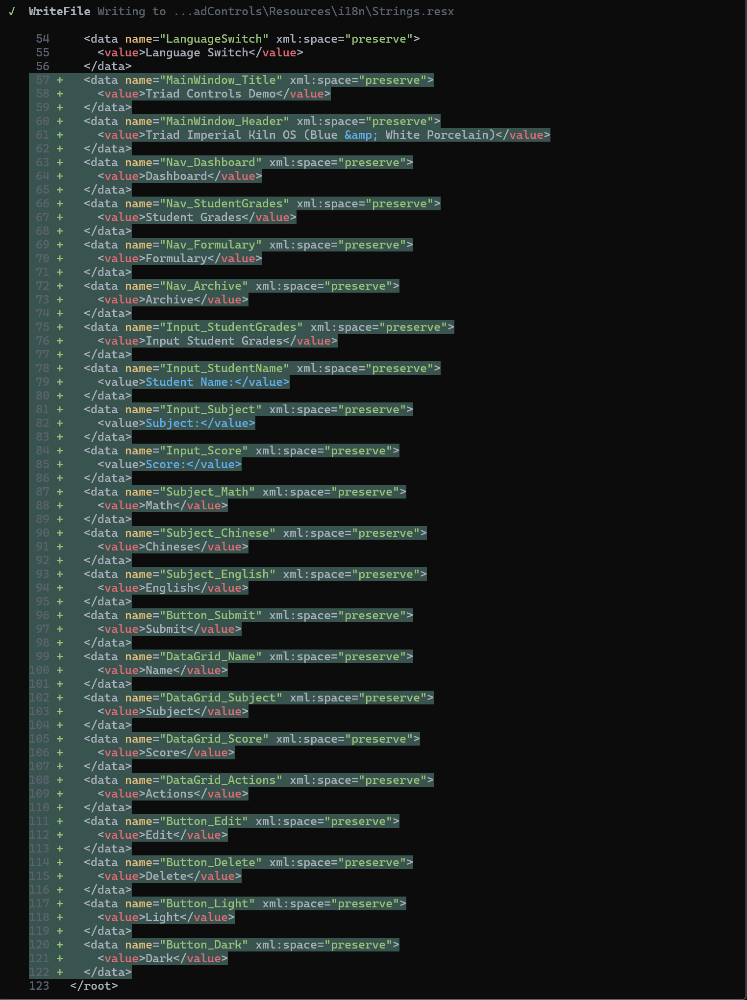
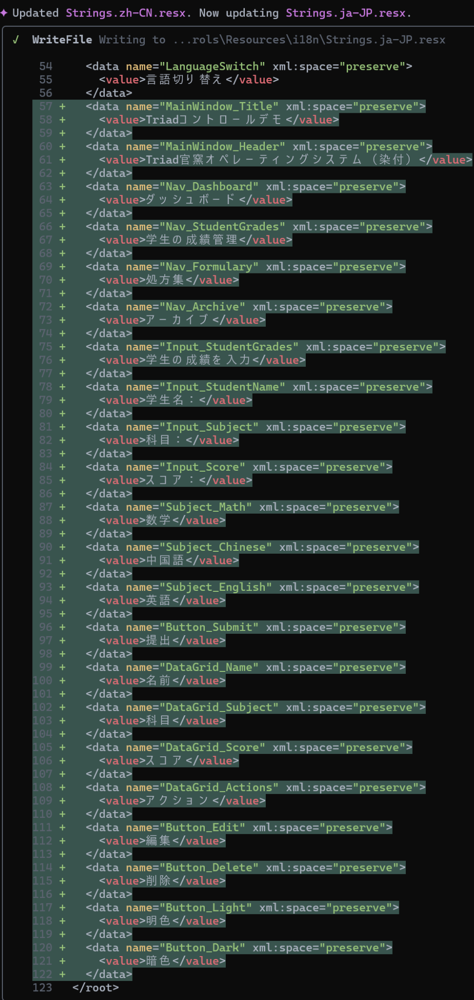

# 🌐 ResxMcp
> A lightweight MCP server for managing `.resx` localization files  
> 一个用于管理 `.resx` 本地化资源文件的轻量级 MCP 服务器

<p align="center">
  
  
  
  
</p>

---

## 🎬 Visual Walkthrough
**Editing multi-language `.resx` via Gemini CLI + ResxMcp**

**Step 1 — Update `Strings.resx` (neutral/en):**  


**Step 2 — Update `Strings.zh-CN.resx` (Simplified Chinese):**  


**Step 3 — Update `Strings.ja-JP.resx` (Japanese):**  


**✅ Step 4 — Final Multilingual Result:**  
Below is the merged multilingual view of all `.resx` files.  


---

---

## 🧭 Overview
**ResxMcp** is a minimal **MCP (Model Context Protocol)** compatible tool server that allows safe **read / write / modify** operations on `.resx` files.  
It works with **any MCP client** such as Gemini CLI, Claude Desktop, or Cursor IDE.

---

## ⚙️ Features
✅ Read `.resx` files as UTF-8 text  
✅ Atomic write with optional `.bak` backup  
✅ Add / update / remove resource keys  
✅ Works with all MCP clients  
✅ Diff-friendly deterministic output

---

## 🧰 Available Tools

| Tool | Description | Parameters |
|------|--------------|-------------|
| `resx.read` | Read `.resx` as UTF-8 text | `{ "file": "path/to/file.resx" }` |
| `resx.write` | Write UTF-8 text (atomic replace) | `{ "file": "path/to/file.resx", "content": "<xml>", "backup": true }` |
| `resx.setEntry` | Add or update a key/value pair | `{ "file": "path/to/file.resx", "name": "Key", "value": "Value", "comment": "Optional" }` |
| `resx.removeEntry` | Remove a key from `.resx` | `{ "file": "path/to/file.resx", "name": "Key" }` |

---

## ⚠️ Installation Notice

Some users may try to install this project with:

```bash
gemini extensions install https://github.com/miaofalianhua/ResxMcp
```

⚠️ **Do NOT do this repeatedly!**  
This command triggers Google’s extension registry verification and may result in **rate limit errors (HTTP 429)** or **installation failure**.

👉 The correct way to use **ResxMcp** is as a **local MCP server**, not a regular Gemini extension.

---

### ✅ Recommended Installation

1️⃣ **Build the project**
```bash
dotnet publish -c Release -r win-x64 -p:PublishSingleFile=true -o ./publish
```

2️⃣ **Register with Gemini CLI**
```bash
gemini mcp add resx-tool "./publish/ResxMcp.exe"
```

3️⃣ **Verify installation**
```bash
gemini @resx-tool tools/list
```

You should see tools such as:  
`resx.read`, `resx.write`, `resx.setEntry`, and `resx.removeEntry`.

💡 *Tip:* If you wish to distribute it as an installable Gemini extension, use the included `gemini-extension.json` (v1.0.2). It wraps this MCP server for one-command installation when the registry supports MCP-only extensions.

---

## 🚀 Quick Start

1. Build your .NET project with localization resources.  
2. Use `resx.read` to inspect `.resx` content.  
3. Modify, translate, or generate `.resx` files automatically with your MCP tools.  
4. Use `resx.write` or `resx.setEntry` to update keys or values.


---

## 🖥️ Example Usage
```bash
gemini @resx-tool tools/call resx.setEntry --arguments '{"file":"lang.zh-CN.resx","name":"App.Title","value":"Triad Controls"}'
```

---

## 🧩 Integration
ResxMcp communicates over **stdio (JSON-RPC)**,  
so it can be used by any modern **AI-assisted development tool** or **automation pipeline** following the MCP standard.

Compatible with:
- 🪄 Gemini CLI  
- 🧠 Claude Desktop  
- 🧰 Cursor IDE  
- ⚙️ Any MCP-based custom workflow

---

## 🪶 License
Licensed under the [MIT License](LICENSE).

---

## ✨ Author
**斌哥 (Miaofalianhua)**  
🌍 GitHub: [@miaofalianhua](https://github.com/miaofalianhua)  
🧠 Focus: C#, Localization, AI-assisted Development

> 💡 *ResxMcp bridges classic .NET localization with modern AI workflows — simple, safe, and open.*
