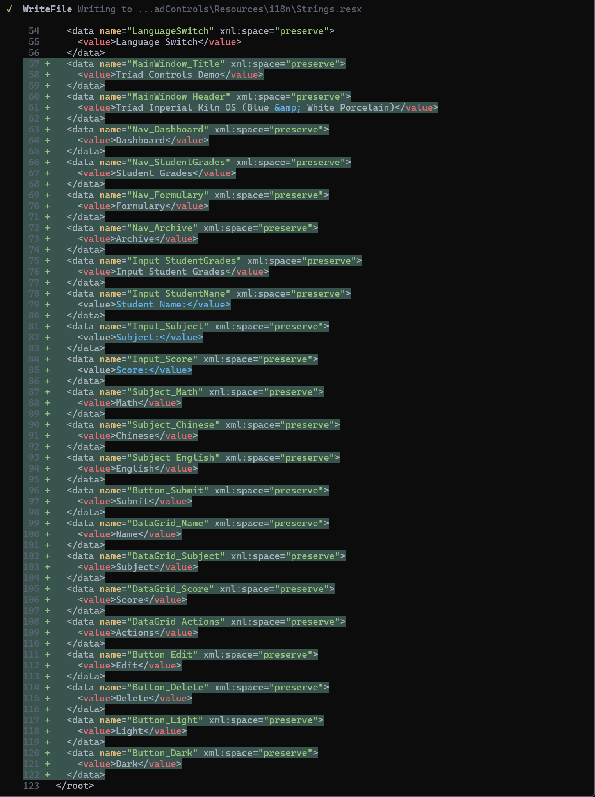
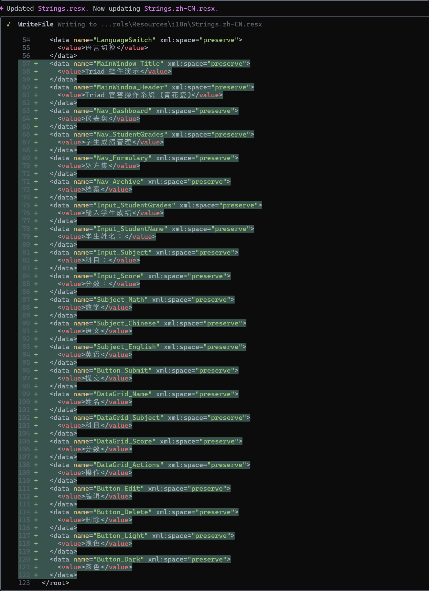
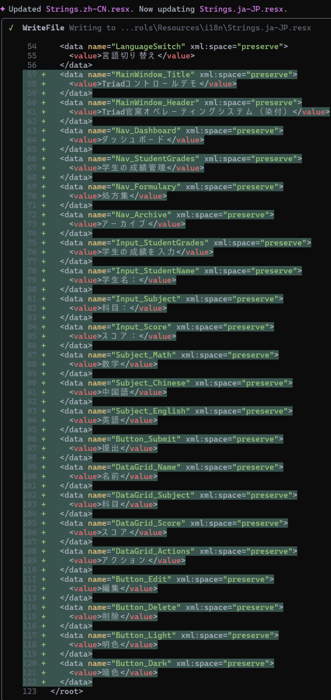
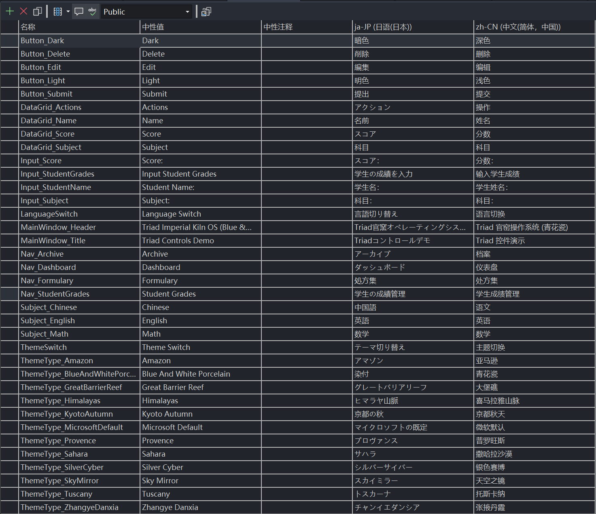

# 🌐 ResxMcp

一个用于管理 `.resx` 多语言资源文件的轻量级 **MCP 协议服务器**，支持 **所有兼容 MCP 的客户端**（Gemini CLI、Claude Desktop、Cursor 等）。

<p align="center">
  
  
  
  
</p>

---

## 🎬 可视化演示
**使用 Gemini CLI + ResxMcp 编辑多语言 `.resx` 文件**

**步骤 1 — 更新 `Strings.resx`（中性/英文）**  


**步骤 2 — 更新 `Strings.zh-CN.resx`（简体中文）**  


**步骤 3 — 更新 `Strings.ja-JP.resx`（日语）**  


**✅ 步骤 4 — 最终多语言结果展示：**  
下图为同步完成后的多语言对照表：  


---

---

## 🧭 项目简介

**ResxMcp** 是一个基于 **MCP（Model Context Protocol）** 的轻量化工具服务器，  
可用于安全地 **读取、写入、修改** `.resx` 资源文件。  
它通过 **JSON-RPC (stdio)** 与外部通信，兼容所有支持 MCP 的客户端。

---

## ⚙️ 功能特点

✅ 读取 `.resx` 文件为 UTF-8 文本  
✅ 原子写入，支持 `.bak` 自动备份  
✅ 支持键值的添加、更新与删除  
✅ 兼容所有 MCP 客户端  
✅ 稳定输出，适合版本对比

---

## 🧰 可用工具

| 工具名 | 功能描述 | 参数 |
|--------|-----------|------|
| `resx.read` | 读取 `.resx` 文件内容 | `{ "file": "路径" }` |
| `resx.write` | 写入 `.resx` 文件（可备份） | `{ "file": "路径", "content": "<xml>", "backup": true }` |
| `resx.setEntry` | 新增或更新键值 | `{ "file": "路径", "name": "Key", "value": "Value", "comment": "备注可选" }` |
| `resx.removeEntry` | 删除指定键 | `{ "file": "路径", "name": "Key" }` |

---

## 🚀 快速上手

### 1️⃣ 构建与发布
```bash
dotnet publish -c Release -r win-x64 -p:PublishSingleFile=true -o ./publish
```

### 2️⃣ 在 Gemini CLI 中注册
```bash
gemini mcp add-process resx-tool "./publish/ResxMcp.exe"
```

### 3️⃣ 测试连接
```bash
gemini @resx-tool tools/list
```

输出应类似：
```json
{
  "tools": [
    "resx.read",
    "resx.write",
    "resx.setEntry",
    "resx.removeEntry"
  ]
}
```

---

## 🧩 集成说明

ResxMcp 使用 **stdio + JSON-RPC** 进行通信，  
可被任何兼容 MCP 协议的客户端或自动化系统调用。

适配示例：  
- 🪄 Gemini CLI  
- 🧠 Claude Desktop  
- 🧰 Cursor IDE  
- ⚙️ 自定义 MCP 自动化工作流

---

## 🪶 开源许可

本项目使用 [MIT License](LICENSE) 开源协议。

---

## ✨ 作者

**斌哥 (Miaofalianhua)**  
🌍 GitHub: [@miaofalianhua](https://github.com/miaofalianhua)  
💬 方向：C#、国际化、多语言资源处理、AI 协作开发  

> 💡 *ResxMcp 让传统 .NET 本地化与现代 AI 工作流无缝衔接——简洁、安全、开放。*
